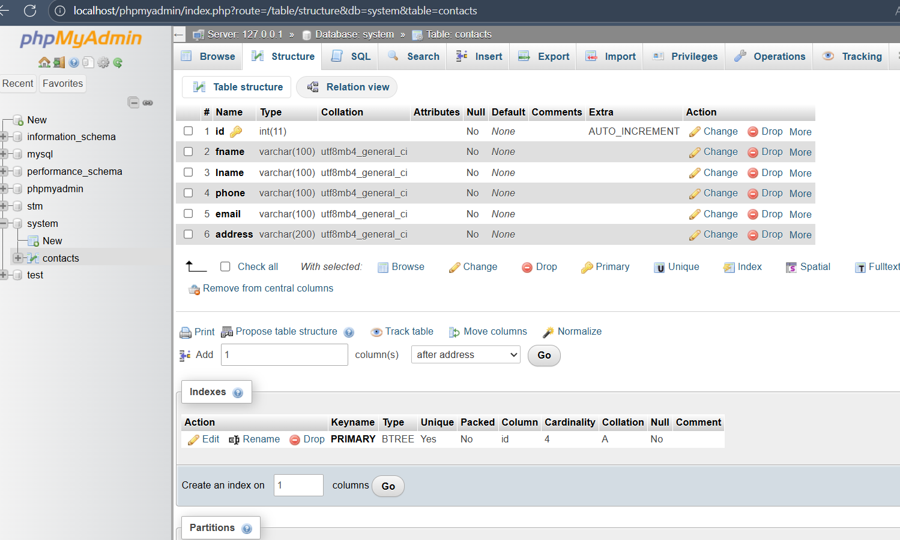
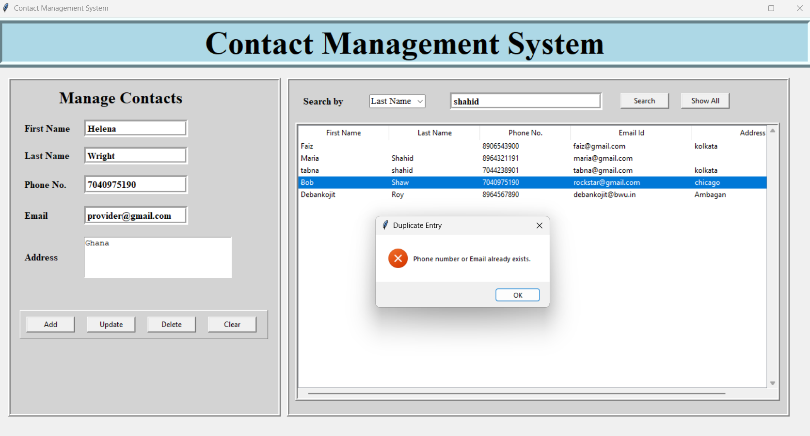
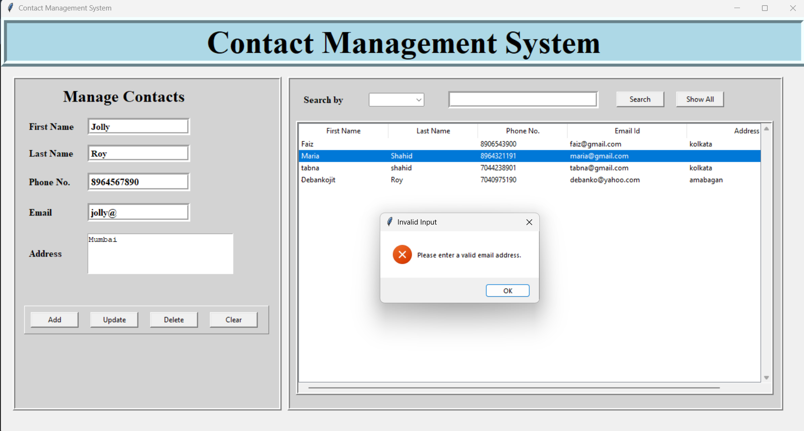
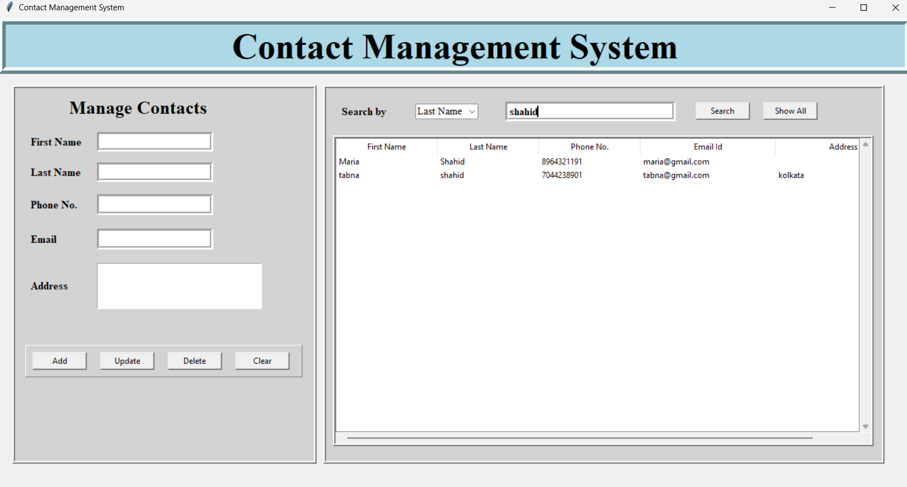

# Contact Management System

A desktop-based Contact Management System built using **Python (Tkinter)** for the user interface and **MySQL** for persistent data storage.  

This application allows users to **add, display, update, delete, and search contacts**, with built-in validation for phone numbers and email addresses.  

---

## Features
- Add new contacts with **First Name, Last Name, Phone, Email, and Address**.
- Display all contacts in a table view with scrollbar support.
- **Update or delete** existing contacts.
- **Search** by First Name, Last Name, or Phone Number.
- **Validation**:
  - Phone number must be exactly 10 digits.
  - Email must contain `@` and `.`.
  - Duplicate phone or email entries are not allowed.

---

## 🛠 Tech Stack
- **Python** – Core programming language.
- **Tkinter** – GUI framework for the desktop application.
- **PyMySQL** – Python-MySQL connector.
- **MySQL** – Database for persistent storage.

---

## ⚙️ Installation & Setup

### 1. Clone the repository
```bash
git clone <your-repo-link>
cd contact-management-system


## To install dependencies

pip install pymysql


## To create MySQL Database

CREATE DATABASE system;
USE system;

CREATE TABLE contacts (
    id INT AUTO_INCREMENT PRIMARY KEY,
    fname VARCHAR(100),
    lname VARCHAR(100),
    phone VARCHAR(100) UNIQUE,
    email VARCHAR(100) UNIQUE,
    address VARCHAR(200)
);

---

## Run the Application

python contact.py









---

## Author

Tabna Shahid

